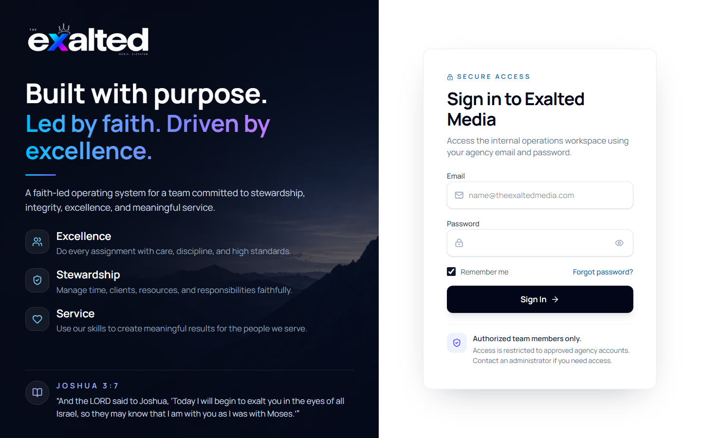
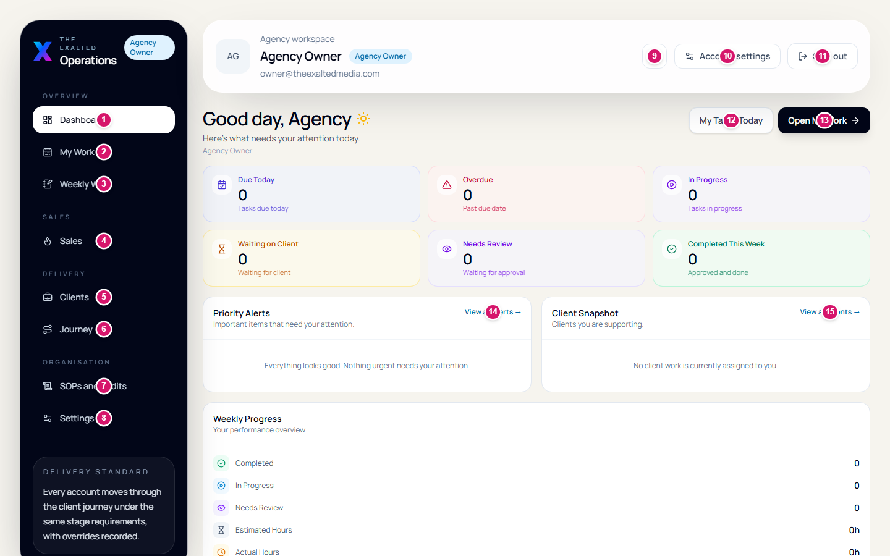
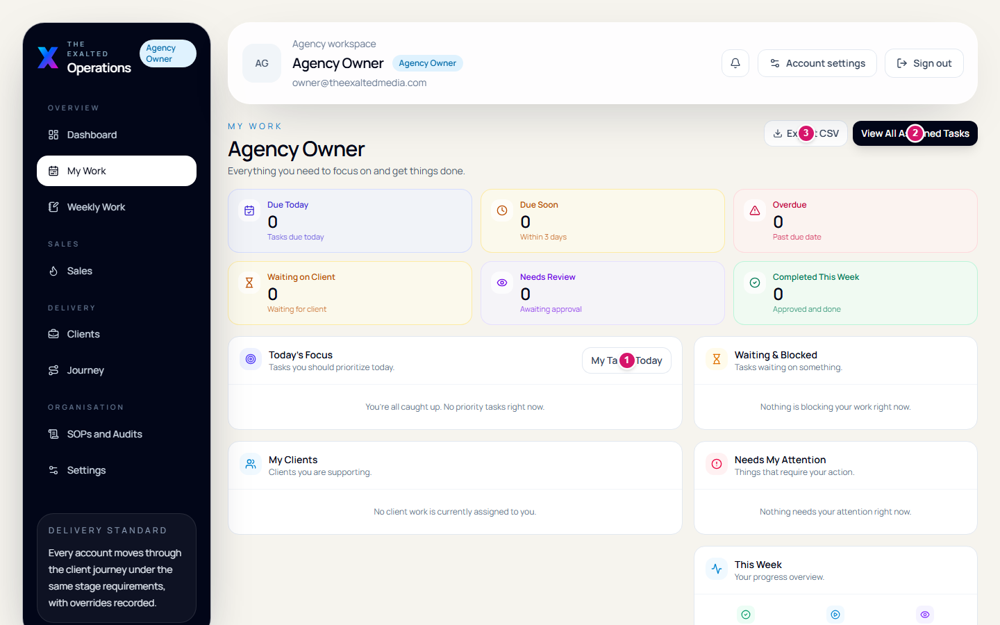
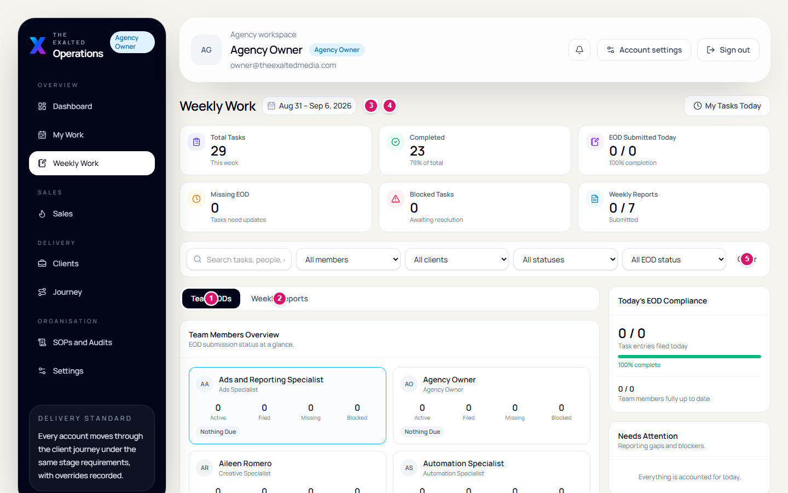
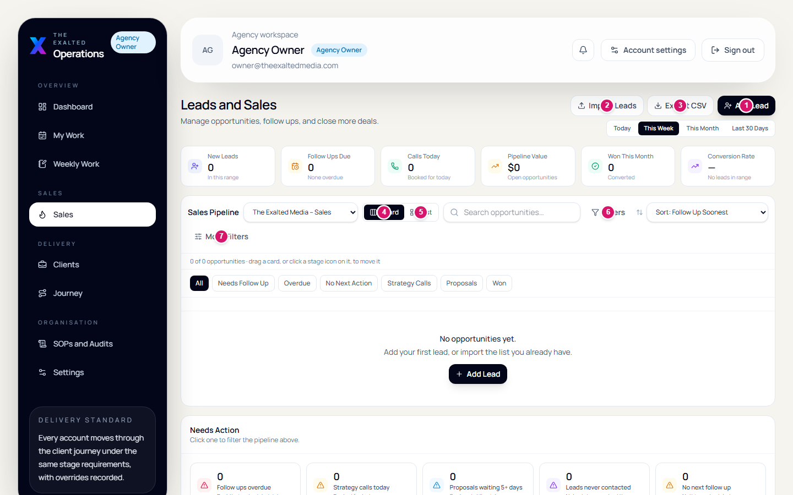
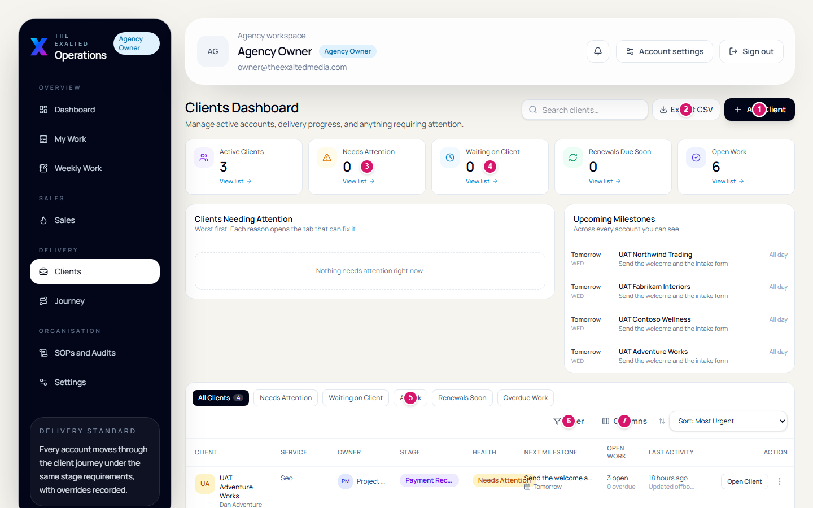
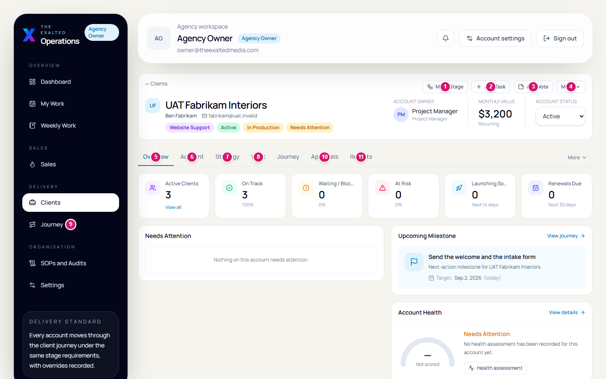
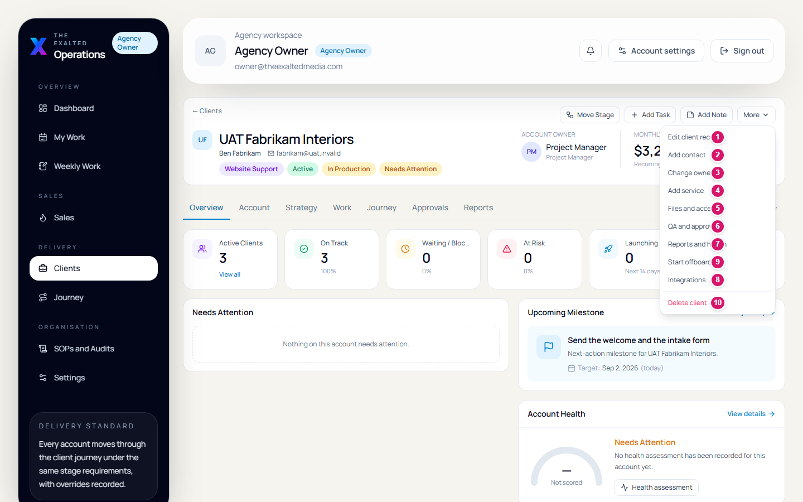
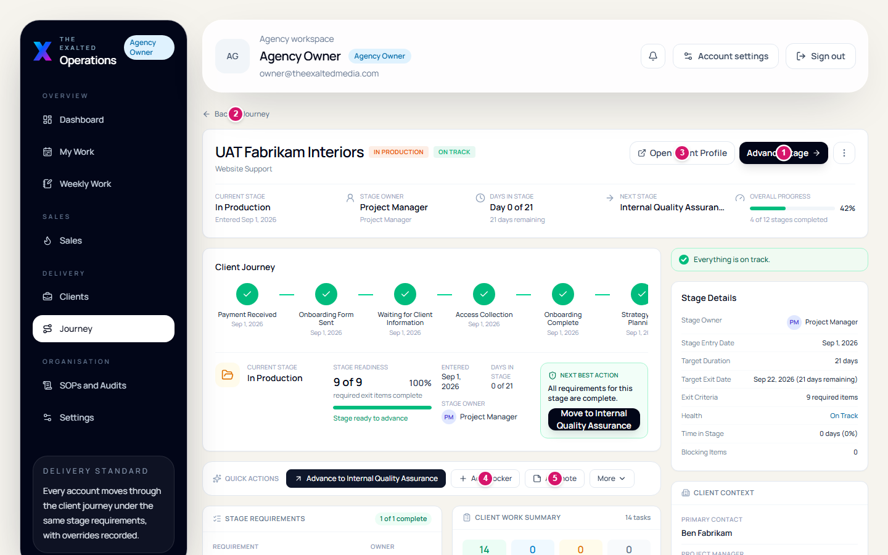

# Every Button, Explained

A picture of each screen, with a number on every button and a plain sentence
saying what it does. The screenshots are of the real system, so what is here is
what is on your screen.

The numbers are drawn at the position the browser reported for each button, so
a pin sits on its button rather than near it.

**Contents**

1. [Signing in](#1-signing-in)
2. [The frame around every page](#2-the-frame-around-every-page)
3. [My Work](#3-my-work)
4. [Weekly Work](#4-weekly-work)
5. [Sales](#5-sales)
6. [Clients](#6-clients)
7. [Inside a client](#7-inside-a-client)
8. [The More menu](#8-the-more-menu)
9. [Moving an account forward](#9-moving-an-account-forward)
10. [Who can press what](#10-who-can-press-what)
11. [If a button will not work](#11-if-a-button-will-not-work)

---

## 1. Signing in

| Field | What it does |
| --- | --- |
| **Email** | Your work address. |
| **Password** | Your own, never a shared one. |
| **Remember me** | Keeps you signed in on this device. |
| **Forgot password?** | Starts a reset. |
| **Sign In** | Takes you to your Dashboard. |

If a page ever bounces you back here, your session has expired — sign in again
and you will land where you were going. Access is limited to approved agency
accounts, so if your address is refused, ask an administrator rather than
trying another password.

---

## 2. The frame around every page

The sidebar on the left and the bar along the top never change. Learn these
once and you can reach everything.

| # | Button | What it does |
| --- | --- | --- |
| 1 | **Dashboard** | Where the agency stands today. Your home screen. |
| 2 | **My Work** | What needs you today, and everything assigned to you. |
| 3 | **Weekly Work** | Daily end-of-day entries and each person's week. |
| 4 | **Sales** | Leads and opportunities, from first contact to won. |
| 5 | **Clients** | Every account you are allowed to see. |
| 6 | **Journey** | Where each account sits, and what is blocking it. |
| 7 | **SOPs and Audits** | The written procedures, audits, and System UAT. |
| 8 | **Settings** | Your own profile, and user accounts if you manage them. |
| 9 | **Notifications** | The bell. Anything waiting on you personally. |
| 10 | **Account settings** | Your name, password and preferences. |
| 11 | **Sign out** | Ends your session on this device. |
| 12 | **My Tasks Today** | Filters straight to what is due today. |
| 13 | **Open My Work** | Jumps to your full work list. |
| 14 | **View all alerts →** | Opens everything flagged as needing attention. |
| 15 | **View all clients →** | Opens the client list. |

### The six cards across the top

**Due Today** · **Overdue** · **In Progress** · **Waiting on Client** ·
**Needs Review** · **Completed This Week**

Each is a count, and each is clickable. Pressing one opens the list it counted,
already filtered. The number and the list always agree.

---

## 3. My Work

Your own list. The screen most people live in.

| # | Button | What it does |
| --- | --- | --- |
| 1 | **My Tasks Today** | Narrows the list to today only. |
| 2 | **View All Assigned Tasks** | Everything assigned to you, not just today. |
| 3 | **Export CSV** | Downloads the current list as a spreadsheet. |

Further down the same page, so not pinned above: **Filters** (narrow by client,
priority, due date or status), **Assign task** (give work to somebody — only
seats that may assign see it), **Open weekly work**, and **View all SOPs**.

### The status tabs

**All** · **Active** · **Needs Review** · **Revision Required** ·
**Completed** · **Archived** — each carries its own count.

**Actions for …** on a row opens what you can do to that one task: change
status, reassign, comment, open the client.

---

## 4. Weekly Work

The week, per person. Where end-of-day entries and weekly reports live.

| # | Button | What it does |
| --- | --- | --- |
| 1 | **Team EODs** | Everybody's end-of-day entries for the week. |
| 2 | **Weekly Reports** | The weekly submissions, and who has not filed. |
| 3 | **Previous week** | Steps back one week. |
| 4 | **Next week** | Steps forward one week. |
| 5 | **Clear** | Removes the person filter and shows the whole team again. |

The initials along the top are your teammates — press one to see only that
person's week. **Weekly reports are due Friday at 17:00.**

---

## 5. Sales

The lead pipeline. Thirteen stages, ending in Won, Lost or Abandoned.

| # | Button | What it does |
| --- | --- | --- |
| 1 | **Add Lead** | Creates a new lead. Also appears at the foot of each column. |
| 2 | **Import Leads** | Bulk-adds leads from a file. |
| 3 | **Export CSV** | Downloads the current view. |
| 4 | **Board** | The kanban view, shown here. Drag a card to move its stage. |
| 5 | **List** | The same leads as a table, easier for bulk scanning. |
| 6 | **Filters** | Owner, source, value and date. |
| 7 | **More Filters** | The less common ones. |

### The pipeline

New Website Lead → Application Submitted → Attempting Contact → Contacted →
Strategy Call Booked → Strategy Call Showed → Qualified → Proposal Sent →
Negotiation

Ends as **Won**, **Lost** or **Abandoned**, or parks in **Long-Term Nurture**.

### Closing a lead

Move the card to **Won**, then use **Convert** on the lead. That creates the
client account and hands it to delivery. Do not create the client separately —
converting is what records the handoff, and a lead can only be converted once.

---

## 6. Clients

Every account you are allowed to see.

| # | Button | What it does |
| --- | --- | --- |
| 1 | **Add Client** | Creates an account. Sets up its workstreams and first tasks for you. |
| 2 | **Export CSV** | Downloads the current list. |
| 3 | **Needs Attention** (card) | Counts accounts with something wrong. Its **View list** filters the table to them. |
| 4 | **Waiting on Client** (card) | Counts accounts blocked on the client's side, and filters to them. |
| 5 | **At Risk** (chip) | Filters the table to accounts whose health is poor. |
| 6 | **Filter** | Owner, service, stage and health. |
| 7 | **Columns** | Choose which columns the table shows. |

Each summary card has its own **View list**. The chips under the table —
**All Clients**, **Needs Attention**, **Waiting on Client**, **At Risk**,
**Renewals Soon**, **Overdue Work** — do the same job from the other direction.

On a row, **Open Client** goes to the record and **Actions for …** offers the
common jobs without leaving the list.

---

## 7. Inside a client

Every account has the same eight tabs and the same four buttons at the top.

| # | Button | What it does |
| --- | --- | --- |
| 1 | **Move Stage** | Advances the account along the journey, if its exit criteria are met. |
| 2 | **Add Task** | Creates a work item against this account. |
| 3 | **Add Note** | Writes a note onto the account's timeline. |
| 4 | **More** | The less common jobs. Opened in the next section. |
| 5 | **Overview** | Where the account stands and what needs attention. |
| 6 | **Account** | Contacts, contract and the commercial basics. |
| 7 | **Strategy** | Services, the strategy brief, goals and A2P registration. |
| 8 | **Work** | Projects, milestones and the work items underneath. |
| 9 | **Journey** | The stage this account is at, and what is blocking the next. |
| 10 | **Approvals** | QA plans and tests, defects, revisions, sign-off, launch. |
| 11 | **Reports** | Client reports, account health and optimisations. |

Behind the tab strip's own **More** sit three groups: *Operations*
(Files & Access, Activity & Notes, Integrations), *Commercial*
(Billing & Payments, Renewal & Growth) and *Lifecycle* (Offboarding).

---

## 8. The More menu

Ten items. One of them destroys data — read the warning before using it.

| # | Button | What it does |
| --- | --- | --- |
| 1 | **Edit client record** | Change the name, service, value or contract details. |
| 2 | **Add contact** | Add somebody on the client's side. |
| 3 | **Change owner** | Hand the account to a different person. |
| 4 | **Add service** | Put another service on the account. |
| 5 | **Files and access** | Platform access: who has it, and whether it has been tested. |
| 6 | **QA and approvals** | Jumps to the Approvals tab. |
| 7 | **Reports and health** | Jumps to the Reports tab. |
| 8 | **Integrations** | Connections to outside tools. |
| 9 | **Start offboarding** | Begins the checklist for ending the engagement. |
| 10 | **Delete client** | Permanently destroys the account. See below. |

> ### ⚠ Delete client and Archive are not the same thing
>
> **Delete client** permanently removes the account and everything attached to
> it — contacts, contract, notes, projects, invoices, journey history,
> approvals and reports. Internal tasks survive but lose their link to the
> account. It asks you to type the company name first, and **it cannot be
> undone**.
>
> **Archive** is what you almost always want instead. It takes the account off
> the active lists and the dashboard counts, keeps every record, and can be
> reversed. You reach it at the end of **Start offboarding**, once the
> checklist is complete.
>
> Rule of thumb: delete only an account that should never have existed — a
> duplicate, or a test row. An engagement that ended gets offboarded and
> archived.

---

## 9. Moving an account forward

| # | Button | What it does |
| --- | --- | --- |
| 1 | **Advance Stage** | Moves the account to the next stage, if every exit item is complete. |
| 2 | **Back to Journey** | Returns to the board showing all accounts. |
| 3 | **Open Client Profile** | Opens the full client record. |
| 4 | **Add blocker** | Records what is holding the account up, so it shows on the board. |
| 5 | **Add note** | Writes a note against the journey, not the account. |

### If Advance Stage refuses

It will tell you which exit items are unmet and give you a link straight to the
page that fixes each one. That is the normal way to move an account: satisfy
the item, then advance.

Two seats — the Agency Owner and the Project Manager — can override a gate, but
an override needs a written reason, is stamped with their name, and is sent to
everyone who can audit. It is a governance event, not a shortcut.

---

## 10. Who can press what

Taken from the system's own permission rules. A dash means the button is not on
your screen at all.

| Button or area | Owner | PM | Sales | Automation | Creative | Ads |
| --- | :-: | :-: | :-: | :-: | :-: | :-: |
| Dashboard, My Work, Weekly Work | ✓ | ✓ | ✓ | ✓ | ✓ | ✓ |
| Sales board | ✓ | ✓ | ✓ | — | — | — |
| Clients and Journey | ✓ | ✓ | ✓ | ✓ | ✓ | ✓ |
| — sees every account | ✓ | ✓ | ✓ | — | — | — |
| SOPs and Audits | ✓ | ✓ | ✓ | ✓ | ✓ | ✓ |
| Add Lead / Convert | ✓ | — | ✓ | — | — | — |
| Add Client | ✓ | ✓ | — | — | — | — |
| Edit client record | ✓ | ✓ | — | — | — | — |
| Move Stage | ✓ | ✓ | — | — | — | — |
| Override a stage gate | ✓ | ✓ | — | — | — | — |
| Assign task | ✓ | ✓ | — | — | — | — |
| Run QA tests | ✓ | ✓ | — | ✓ | ✓ | ✓ |
| Close a defect | ✓ | ✓ | — | — | — | — |
| Record client approval | ✓ | ✓ | — | — | — | — |
| Send client reports | ✓ | ✓ | — | — | — | ✓ |
| Billing and renewals | ✓ | ✓ | — | — | — | — |
| Start offboarding | ✓ | ✓ | — | — | — | — |
| Archive / Delete client | ✓ | ✓ | — | — | — | — |
| Record a UAT result | ✓ | ✓ | ✓ | ✓ | ✓ | ✓ |
| Approve for Limited Beta | ✓ | ✓ | — | — | — | — |

Specialists see **Clients** and **Journey**, but only the accounts assigned to
them.

Two rules apply to everybody and cannot be granted around: you cannot approve
or close your own work, and an archived account cannot be moved along the
journey.

---

## 11. If a button will not work

| Reason | What to do |
| --- | --- |
| **The gate is not met** | Mostly on **Advance Stage**. You are told which exit item is missing and given a link to the page that fixes it. |
| **It is not your seat** | The button is not on your screen at all rather than greyed out. Check the table above for who to ask. |
| **It is your own work** | You cannot close a defect against your own build, or approve your own brief. Deliberate, and not something a permission can unlock. |
| **The account is archived** | Archived accounts are read-only for delivery work. Restore it first if it really is active again. |

---

*Screenshots are of the UAT environment, whose accounts are named `UAT …`. Your
own workspace shows real client names in their place.*
